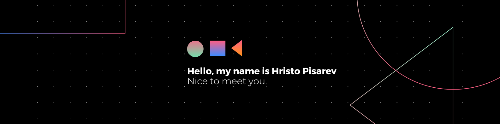

Hi there 👋
I am Hristo Pisarev,a curious enginner exploring the deep fields of software development with aim of becoming a full-stack developer.

📌 Pinned Repositories

 

   
   

📈 GitHub Stats
 
 

